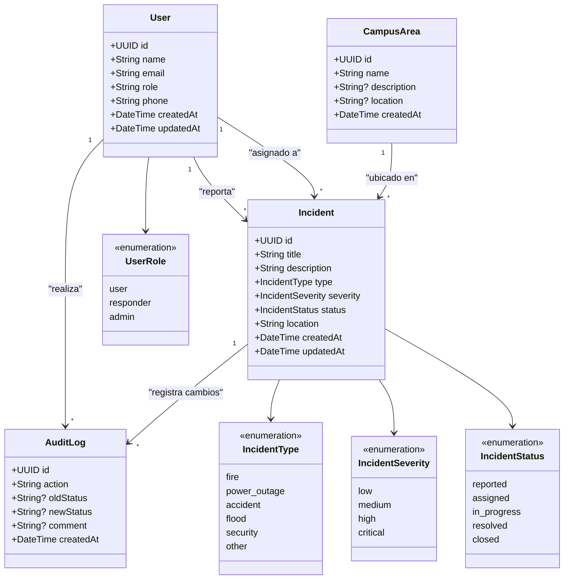

# Diagrama de Clases

## Diagrama

## Descripción de Clases

### User
Representa a cualquier persona que interactúa con el sistema (estudiantes, docentes, personal administrativo, responders).

| Atributo   | Tipo       | Descripción                              |
| ---------- | ---------- | ---------------------------------------- |
| id         | UUID       | Identificador único                      |
| name       | String     | Nombre completo                          |
| email      | String     | Correo electrónico (único)               |
| role       | UserRole   | Rol en el sistema: user, responder, admin |
| phone      | String?    | Teléfono de contacto                     |
| createdAt  | DateTime   | Fecha de registro                        |
| updatedAt  | DateTime   | Fecha de última modificación             |

### Incident
Núcleo del sistema. Representa un incidente o emergencia reportada.

| Atributo    | Tipo            | Descripción                             |
| ----------- | --------------- | --------------------------------------- |
| id          | UUID            | Identificador único                     |
| title       | String          | Título corto del incidente              |
| description | String          | Descripción detallada                   |
| type        | IncidentType    | Tipo de emergencia                      |
| severity    | IncidentSeverity| Nivel de gravedad                       |
| status      | IncidentStatus  | Estado actual del flujo de resolución   |
| location    | String          | Ubicación dentro del campus             |
| reportedBy  | User            | Usuario que reportó                     |
| assignedTo  | User?           | Responsable asignado (nullable)         |
| area        | CampusArea?     | Área del campus (nullable)              |
| createdAt   | DateTime        | Fecha del reporte                       |
| updatedAt   | DateTime        | Fecha de última actualización           |

### AuditLog
Registro de auditoría para tracking de cambios en incidentes.

| Atributo  | Tipo     | Descripción                              |
| --------- | -------- | ---------------------------------------- |
| id        | UUID     | Identificador único                      |
| incident  | Incident | Incidente asociado                      |
| user      | User     | Usuario que realizó la acción            |
| action    | String   | Acción realizada (created, assigned, status_changed, etc.) |
| oldStatus | String?  | Estado anterior (si aplica)              |
| newStatus | String?  | Estado nuevo (si aplica)                 |
| comment   | String?  | Comentario opcional                      |
| createdAt | DateTime | Fecha de la acción                       |

### CampusArea
Área o edificio del campus donde ocurre el incidente.

| Atributo    | Tipo     | Descripción                    |
| ----------- | -------- | ------------------------------ |
| id          | UUID     | Identificador único            |
| name        | String   | Nombre del área/edificio       |
| description | String?  | Descripción opcional           |
| location    | String?  | Coordenadas o referencia       |
| createdAt   | DateTime | Fecha de registro              |
