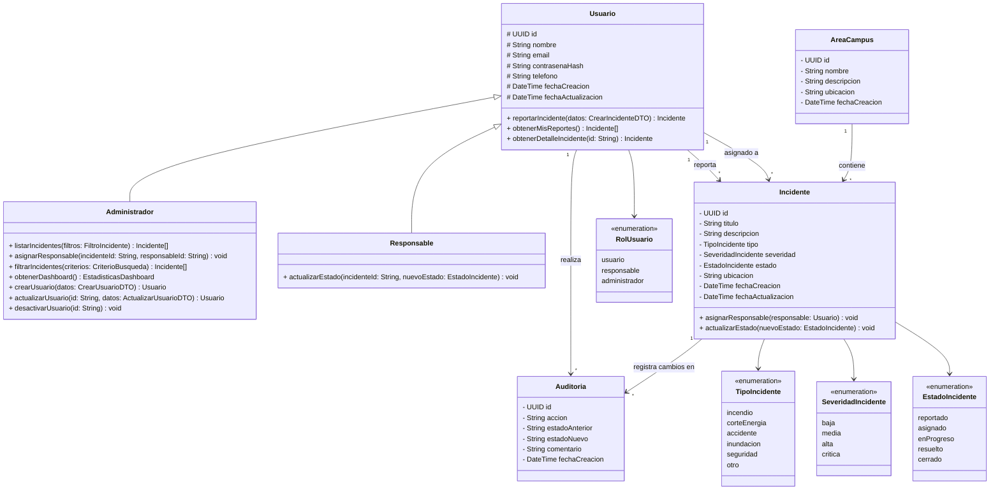

# Diagrama de Clases

## Diagrama

## Mapeo Casos de Uso → Métodos

| Caso de Uso               | Clase           | Método                              |
| ------------------------- | --------------- | ----------------------------------- |
| UC01 Reportar Incidente   | `Usuario`       | `reportarIncidente(datos)`          |
| UC02 Ver Mis Reportes     | `Usuario`       | `obtenerMisReportes()`              |
| UC03 Ver Detalle          | `Usuario`       | `obtenerDetalleIncidente(id)`       |
| UC04 Listar Incidentes    | `Administrador` | `listarIncidentes(filtros)`         |
| UC05 Asignar Responsable  | `Administrador` | `asignarResponsable(incidenteId, responsableId)` |
| UC06 Actualizar Estado    | `Responsable`   | `actualizarEstado(incidenteId, nuevoEstado)` |
| UC07 Filtrar Incidentes   | `Administrador` | `filtrarIncidentes(criterios)`      |
| UC08 Ver Dashboard        | `Administrador` | `obtenerDashboard()`                |
| UC09 Gestionar Usuarios   | `Administrador` | `crearUsuario`, `actualizarUsuario`, `desactivarUsuario` |

## Descripción de Clases

### Usuario (abstracta)
Clase base para todos los actores del sistema.

| Atributo        | Tipo       | Descripción                         |
| --------------- | ---------- | ----------------------------------- |
| id              | UUID       | Identificador único                 |
| nombre          | String     | Nombre completo                     |
| email           | String     | Correo electrónico (único)          |
| contrasenaHash  | String     | Hash de contraseña                  |
| telefono        | String?    | Teléfono de contacto                |
| fechaCreacion   | DateTime   | Fecha de registro                   |
| fechaActualizacion | DateTime | Fecha de última modificación      |

| Método                              | Descripción                                   |
| ----------------------------------- | --------------------------------------------- |
| `reportarIncidente(datos)`          | Crea un nuevo incidente en el sistema (UC01)  |
| `obtenerMisReportes()`              | Devuelve los incidentes reportados por el usuario (UC02) |
| `obtenerDetalleIncidente(id)`       | Obtiene la información completa de un incidente (UC03) |

### Administrador (hereda de Usuario)
Usuario con permisos de gestión total del sistema.

| Método                                   | Descripción                                       |
| ---------------------------------------- | ------------------------------------------------- |
| `listarIncidentes(filtros)`              | Lista todos los incidentes con paginación (UC04)  |
| `asignarResponsable(incidenteId, responsableId)` | Asigna un responsable a un incidente (UC05) |
| `filtrarIncidentes(criterios)`           | Filtra incidentes por tipo, estado, severidad (UC07) |
| `obtenerDashboard()`                     | Devuelve estadísticas del sistema (UC08)          |
| `crearUsuario(datos)`                    | Registra un nuevo usuario en el sistema (UC09)    |
| `actualizarUsuario(id, datos)`           | Modifica los datos de un usuario (UC09)           |
| `desactivarUsuario(id)`                  | Desactiva el acceso de un usuario (UC09)          |

### Responsable (hereda de Usuario)
Usuario asignado a la atención y resolución de incidentes.

| Método                                       | Descripción                                  |
| -------------------------------------------- | -------------------------------------------- |
| `actualizarEstado(incidenteId, nuevoEstado)` | Cambia el estado del incidente asignado (UC06) |

### Incidente
Representa una emergencia o incidente reportado en el campus.

| Atributo        | Tipo                | Descripción                          |
| --------------- | ------------------- | ------------------------------------ |
| id              | UUID                | Identificador único                  |
| titulo          | String              | Título corto del incidente           |
| descripcion     | String              | Descripción detallada                |
| tipo            | TipoIncidente       | Tipo de emergencia                   |
| severidad       | SeveridadIncidente  | Nivel de gravedad                    |
| estado          | EstadoIncidente     | Estado actual del flujo de resolución|
| ubicacion       | String              | Ubicación dentro del campus          |
| fechaCreacion   | DateTime            | Fecha del reporte                    |
| fechaActualizacion | DateTime         | Fecha de última actualización        |

| Método                             | Descripción                                     |
| ---------------------------------- | ----------------------------------------------- |
| `asignarResponsable(responsable)`  | Asigna un usuario como responsable del incidente|
| `actualizarEstado(nuevoEstado)`    | Transiciona al estado siguiente en el flujo     |

### Auditoria
Registro de cambios y acciones realizadas sobre los incidentes.

| Atributo       | Tipo     | Descripción                              |
| -------------- | -------- | ---------------------------------------- |
| id             | UUID     | Identificador único                      |
| accion         | String   | Acción realizada (creado, asignado, cambio_estado, etc.) |
| estadoAnterior | String?  | Estado antes del cambio                  |
| estadoNuevo    | String?  | Estado después del cambio                |
| comentario     | String?  | Comentario opcional                      |
| fechaCreacion  | DateTime | Fecha de la acción                       |

### AreaCampus
Área o edificio del campus universitario.

| Atributo    | Tipo     | Descripción                    |
| ----------- | -------- | ------------------------------ |
| id          | UUID     | Identificador único            |
| nombre      | String   | Nombre del área o edificio     |
| descripcion | String?  | Descripción opcional           |
| ubicacion   | String?  | Coordenadas o referencia       |
| fechaCreacion | DateTime | Fecha de registro             |
