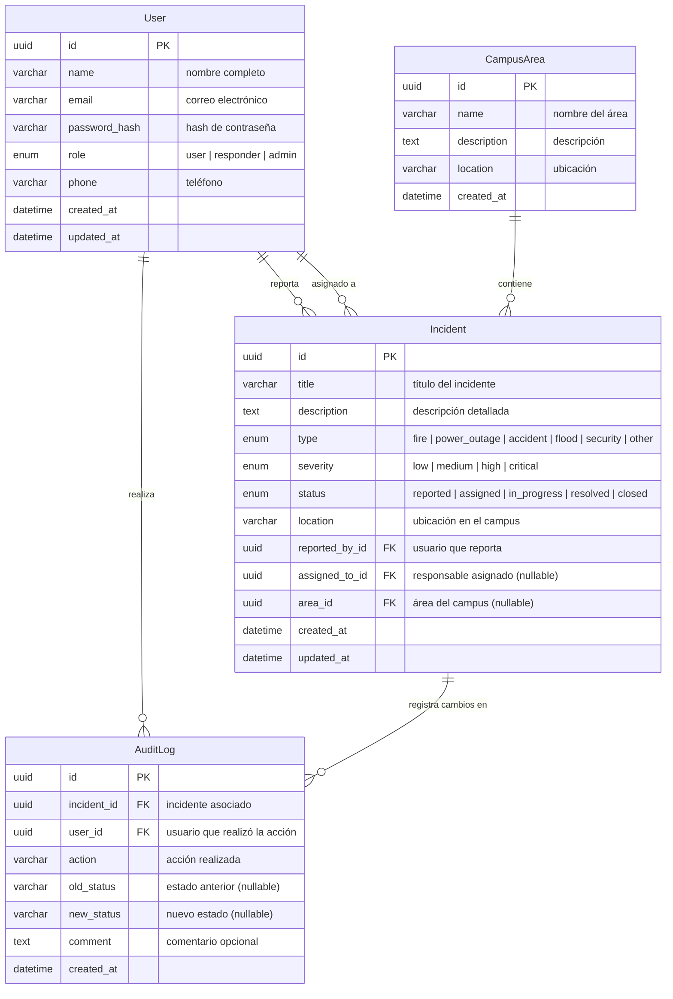

# Modelo de Base de Datos

## Diagrama Entidad-Relación

## Diccionario de Datos

### Tabla: `users`

| Columna        | Tipo         | Restricciones        | Descripción                          |
| -------------- | ------------ | -------------------- | ------------------------------------ |
| id             | `uuid`       | PK, DEFAULT gen_random_uuid() | Identificador único       |
| name           | `varchar`    | NOT NULL             | Nombre completo del usuario          |
| email          | `varchar`    | NOT NULL, UNIQUE     | Correo electrónico institucional     |
| password_hash  | `varchar`    | NOT NULL             | Hash de contraseña (bcrypt)          |
| role           | `varchar`    | NOT NULL, DEFAULT 'user' | Rol: user, responder, admin        |
| phone          | `varchar`    | NULLABLE             | Teléfono de contacto                 |
| created_at     | `timestamptz`| NOT NULL, DEFAULT now() | Fecha de creación                  |
| updated_at     | `timestamptz`| NOT NULL, DEFAULT now() | Fecha de última modificación       |

### Tabla: `incidents`

| Columna        | Tipo         | Restricciones        | Descripción                          |
| -------------- | ------------ | -------------------- | ------------------------------------ |
| id             | `uuid`       | PK, DEFAULT gen_random_uuid() | Identificador único       |
| title          | `varchar`    | NOT NULL             | Título corto del incidente           |
| description    | `text`       | NOT NULL             | Descripción detallada                |
| type           | `varchar`    | NOT NULL             | Tipo de emergencia                   |
| severity       | `varchar`    | NOT NULL             | Nivel de gravedad                    |
| status         | `varchar`    | NOT NULL, DEFAULT 'reported' | Estado actual del incidente   |
| location       | `varchar`    | NOT NULL             | Ubicación dentro del campus          |
| reported_by_id | `uuid`       | FK -> users.id, NOT NULL | Usuario que reportó                |
| assigned_to_id | `uuid`       | FK -> users.id, NULLABLE | Responsable asignado               |
| area_id        | `uuid`       | FK -> campus_areas.id, NULLABLE | Área del campus               |
| created_at     | `timestamptz`| NOT NULL, DEFAULT now() | Fecha del reporte                   |
| updated_at     | `timestamptz`| NOT NULL, DEFAULT now() | Fecha de última actualización        |

### Tabla: `audit_logs`

| Columna      | Tipo         | Restricciones        | Descripción                          |
| ------------ | ------------ | -------------------- | ------------------------------------ |
| id           | `uuid`       | PK, DEFAULT gen_random_uuid() | Identificador único       |
| incident_id  | `uuid`       | FK -> incidents.id, NOT NULL | Incidente asociado                |
| user_id      | `uuid`       | FK -> users.id, NOT NULL | Usuario que realizó la acción        |
| action       | `varchar`    | NOT NULL             | Acción: created, assigned, status_changed, etc. |
| old_status   | `varchar`    | NULLABLE             | Estado anterior                      |
| new_status   | `varchar`    | NULLABLE             | Nuevo estado                         |
| comment      | `text`       | NULLABLE             | Comentario opcional                  |
| created_at   | `timestamptz`| NOT NULL, DEFAULT now() | Fecha de la acción                  |

### Tabla: `campus_areas`

| Columna    | Tipo         | Restricciones        | Descripción                    |
| ---------- | ------------ | -------------------- | ------------------------------ |
| id         | `uuid`       | PK, DEFAULT gen_random_uuid() | Identificador único |
| name       | `varchar`    | NOT NULL, UNIQUE     | Nombre del área o edificio     |
| description| `text`       | NULLABLE             | Descripción opcional           |
| location   | `varchar`    | NULLABLE             | Coordenadas o referencia       |
| created_at | `timestamptz`| NOT NULL, DEFAULT now() | Fecha de registro            |

## Índices

| Tabla       | Índice                          | Tipo    | Columnas          |
| ----------- | ------------------------------- | ------- | ----------------- |
| incidents   | idx_incidents_status            | BTREE   | status            |
| incidents   | idx_incidents_type              | BTREE   | type              |
| incidents   | idx_incidents_severity          | BTREE   | severity          |
| incidents   | idx_incidents_reported_by       | BTREE   | reported_by_id    |
| incidents   | idx_incidents_assigned_to       | BTREE   | assigned_to_id    |
| incidents   | idx_incidents_created_at        | BTREE   | created_at        |
| audit_logs  | idx_audit_logs_incident         | BTREE   | incident_id       |
| users       | idx_users_email                 | UNIQUE  | email             |
