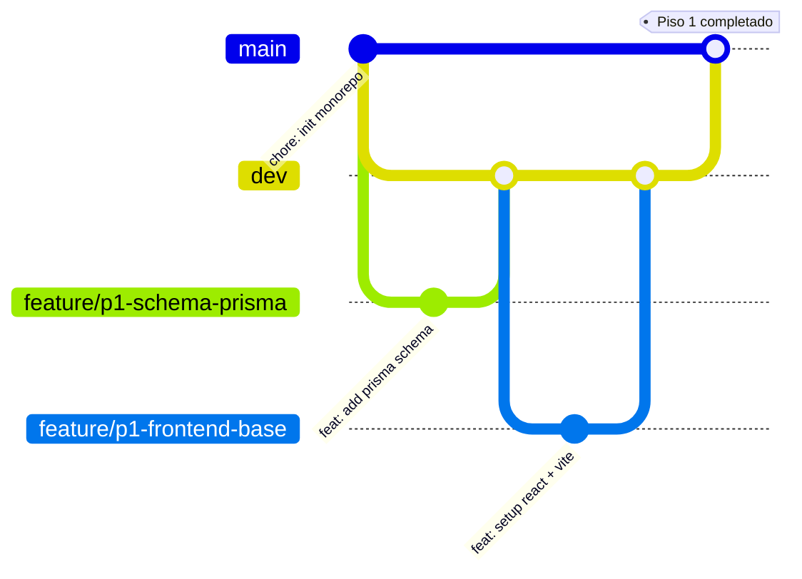

# Planificación — Sistema de Gestión de Emergencias Universitarias

## Estructura del proyecto: Construcción por pisos

```text
PISO 6 ─── ACABADOS ─── Testing, responsive, pulido final
PISO 5 ─── ADMINISTRACIÓN ─── Dashboard, usuarios, filtros
PISO 4 ─── GESTIÓN ─── Asignar responsable, cambiar estado
PISO 3 ─── FUNCIONALIDAD CORE ─── CRUD de incidentes
PISO 2 ─── ESTRUCTURA ─── Autenticación y autorización
PISO 1 ─── CIMENTACIÓN ─── Infraestructura base
```

Cada piso se apoya en el anterior. No se puede empezar un piso sin tener firmes los de abajo.

---

## PISO 1 — CIMENTACIÓN (Infraestructura base)

**Objetivo**: Dejar el entorno de desarrollo funcionando y conectado.

| Tarea | Descripción | Responsable | Branch |
|---|---|---|---|
| P1.1 | Schema Prisma completo (users, roles, incidents, audit_logs, campus_areas, refresh_tokens) + migración inicial + seed | David | `feature/p1-schema-prisma` |
| P1.2 | Módulo Prisma en NestJS (conexión a DB, módulo global) | Joaquín | `feature/p1-modulo-prisma` |
| P1.3 | Estructura base del frontend: layout, routing (react-router), navbar, shadcn/ui init | Nicolás | `feature/p1-frontend-base` |
| P1.4 | Configuración de Docker Compose (PostgreSQL), variables de entorno, verificar conexión full-stack | Joaquín | `feature/p1-docker-setup` |
| P1.5 | Configurar shadcn/ui, tema y componentes base (Button, Card, Input, Table, Dialog) | Jhoan | `feature/p1-shadcn-setup` |

**Criterio de éxito**: `pnpm dev` levanta backend y frontend, backend conecta a PostgreSQL, frontend muestra layout base.

---

## PISO 2 — ESTRUCTURA (Autenticación y Autorización)

**Objetivo**: Usuarios pueden registrarse e iniciar sesión. Rutas protegidas por rol.

| Tarea | Descripción | Responsable | Branch |
|---|---|---|---|
| P2.1 | Módulo de Auth en NestJS: register, login, JWT, guards, decorador @CurrentUser | Joaquín | `feature/p2-auth-backend` |
| P2.2 | Servicio de Roles y autorización por roles (RolesGuard) | David | `feature/p2-roles-backend` |
| P2.3 | Página de Login + Register con React Hook Form + Zod | Nicolás | `feature/p2-auth-pages` |
| P2.4 | Hook personalizado `useAuth` con TanStack Query (login, register, logout, session) | Jhoan | `feature/p2-auth-hook` |
| P2.5 | Proteger rutas por rol (AdminRoute, ResponsableRoute) + redirect si no autenticado | Nicolás | `feature/p2-auth-guard-frontend` |

**Criterio de éxito**: Usuario se registra, inicia sesión, obtiene JWT, rutas se protegen según rol.

---

## PISO 3 — FUNCIONALIDAD CORE (Módulo de Incidentes)

**Objetivo**: Reportar, listar y ver incidentes (UC01, UC02, UC03).

| Tarea | Descripción | Responsable | Branch |
|---|---|---|---|
| P3.1 | CRUD de incidentes en NestJS (crear, listar, obtener por id) + Zod validation + Prisma | Joaquín | `feature/p3-incidentes-api` |
| P3.2 | Servicio de Auditoría (registrar automáticamente created, cambios de estado) | David | `feature/p3-auditoria-servicio` |
| P3.3 | Formulario "Reportar Incidente" con React Hook Form + Zod + shadcn/ui | Nicolás | `feature/p3-reportar-incidente` |
| P3.4 | Página "Mis Reportes" (lista de incidentes del usuario logueado) con TanStack Query | Jhoan | `feature/p3-mis-reportes` |
| P3.5 | Página de detalle de incidente con información completa y timeline de auditoría | Jhoan | `feature/p3-detalle-incidente` |

**Criterio de éxito**: Usuario reporta un incidente, aparece en "Mis Reportes", puede ver el detalle.

---

## PISO 4 — GESTIÓN (Asignación y Cambio de Estado)

**Objetivo**: Administrador asigna responsables. Responsable cambia estados (UC05, UC06).

| Tarea | Descripción | Responsable | Branch |
|---|---|---|---|
| P4.1 | Endpoint para asignar responsable a incidente + validar regla RN-002 | David | `feature/p4-asignar-api` |
| P4.2 | Endpoint para actualizar estado con flujo validado (RN-001, RN-005) | Joaquín | `feature/p4-estado-api` |
| P4.3 | UI de "Asignar Responsable" (selector de usuarios con rol responder) en detalle de incidente | Jhoan | `feature/p4-asignar-ui` |
| P4.4 | UI de "Cambiar Estado" (botones según estado actual + reglas de negocio) en detalle de incidente | Nicolás | `feature/p4-estado-ui` |
| P4.5 | Lista de incidentes asignados al responsable logueado | Jhoan | `feature/p4-mis-asignaciones` |

**Criterio de éxito**: Admin asigna un responsable. Responsable ve la asignación y cambia el estado.

---

## PISO 5 — ADMINISTRACIÓN (Dashboard, Filtros y Usuarios)

**Objetivo**: Panel de administración con estadísticas, listado completo y gestión de usuarios (UC04, UC07, UC08, UC09).

| Tarea | Descripción | Responsable | Branch |
|---|---|---|---|
| P5.1 | Endpoints de dashboard: conteo por estado, tipo, severidad + incidentes recientes | Joaquín | `feature/p5-dashboard-api` |
| P5.2 | Endpoints CRUD de usuarios (crear, listar, editar, desactivar) + validación Zod | David | `feature/p5-usuarios-api` |
| P5.3 | Endpoint de listar todos los incidentes con filtros (tipo, estado, severidad, fecha, paginación) | David | `feature/p5-filtros-api` |
| P5.4 | Página Dashboard con cards de estadísticas y gráficos (chart.js o recharts) | Nicolás | `feature/p5-dashboard-ui` |
| P5.5 | Página de gestión de usuarios (tabla + formulario crear/editar + desactivar) | Jhoan | `feature/p5-usuarios-ui` |
| P5.6 | Tabla de todos los incidentes con filtros y paginación (frontend) | Nicolás | `feature/p5-lista-filtros-ui` |

**Criterio de éxito**: Admin ve dashboard con estadísticas, lista todos los incidentes con filtros, gestiona usuarios.

---

## PISO 6 — ACABADOS (Refinamiento y Calidad)

**Objetivo**: Pulir la aplicación, probar y dejar lista para producción.

| Tarea | Descripción | Responsable | Branch |
|---|---|---|---|
| P6.1 | Polling cada 10s con TanStack Query (refetchInterval) para tiempo real (RNF-001) | Jhoan | `feature/p6-polling-tiempo-real` |
| P6.2 | Diseño responsive para móviles + pruebas en distintos viewports (RNF-002) | Nicolás | `feature/p6-responsive` |
| P6.3 | Tests de integración del backend (módulos auth, incidentes, usuarios con Jest) | Joaquín | `feature/p6-tests-backend` |
| P6.4 | Pruebas end-to-end con Playwright (flujo completo: registro → reporte → asignación → cierre) | David | `feature/p6-tests-e2e` |
| P6.5 | Documentación de API con Swagger (@nestjs/swagger) | Joaquín | `feature/p6-swagger-docs` |

**Criterio de éxito**: App responsive, polling activo, tests pasando, Swagger documentado.

---

## Guía de GitHub para el equipo

### Estructura de ramas



### Convenciones

| Elemento | Regla |
|---|---|
| **Rama principal** | `main` — siempre estable, solo se fusiona desde `dev` |
| **Rama de integración** | `dev` — aquí se fusionan las features branches |
| **Ramas de tarea** | `feature/<piso>-<descripcion-corta>` (ej. `feature/p3-reportar-incidente`) |
| **Commits** | Usar [Conventional Commits](https://www.conventionalcommits.org/): `feat:`, `fix:`, `chore:`, `refactor:`, `test:`, `docs:` |
| **Pull Requests** | Toda feature branch se fusiona a `dev` mediante PR con al menos 1 approval |

### Flujo de trabajo diario

```bash
# 1. Partir siempre desde dev actualizada
git checkout dev
git pull origin dev

# 2. Crear rama para la tarea asignada
git checkout -b feature/p3-reportar-incidente

# 3. Trabajar con commits convencionales
git add .
git commit -m "feat: add incident creation endpoint"

# 4. Publicar la rama
git push origin feature/p3-reportar-incidente

# 5. Crear Pull Request en GitHub hacia dev
#    - Título descriptivo: "P3 - Formulario de reportar incidente"
#    - Descripción: qué se hizo, qué probar, screenshots si aplica
#    - Asignar reviewer (Joaquín lider)
#    - Linkear con el issue de GitHub si existe

# 6. Después de aprobación, mergear a dev
git checkout dev
git merge feature/p3-reportar-incidente
git push origin dev

# 7. Eliminar la rama local y remota
git branch -d feature/p3-reportar-incidente
git push origin --delete feature/p3-reportar-incidente
```

### Responsabilidades

| Rol | Persona | Responsabilidad |
|---|---|---|
| **Líder del proyecto** | Joaquín | Revisar y aprobar PRs, mergear a `dev` y `main`, velar por la arquitectura |
| **Backend** | Joaquín + David | Implementar APIs, base de datos, lógica de negocio |
| **Frontend** | Nicolás + Jhoan | Implementar interfaces, formularios, conexión con API, experiencia de usuario |

### Reglas del equipo

1. **Nadie mergea directo a `main`** — solo Joaquín fusiona `dev` → `main` cuando un piso completo está estable.
2. **Toda tarea tiene su rama** — no se trabaja nunca sobre `dev` directo.
3. **Los PRs deben tener al menos 1 approval** antes de mergear.
4. **Commits pequeños y descriptivos** — mejor 5 commits que 1 commit gigante.
5. **`pnpm build` debe pasar antes de crear un PR** — verificar que no hay errores de tipos ni compilación.
6. **Sync con `dev` frecuentemente** — `git pull origin dev` en tu feature branch para evitar conflictos grandes.

### Resumen de branches del proyecto

| Rama | Propósito |
|---|---|
| `main` | Código en producción (estable) |
| `dev` | Integración de todas las features |
| `feature/p1-*` | Tareas del Piso 1 |
| `feature/p2-*` | Tareas del Piso 2 |
| `feature/p3-*` | Tareas del Piso 3 |
| `feature/p4-*` | Tareas del Piso 4 |
| `feature/p5-*` | Tareas del Piso 5 |
| `feature/p6-*` | Tareas del Piso 6 |
